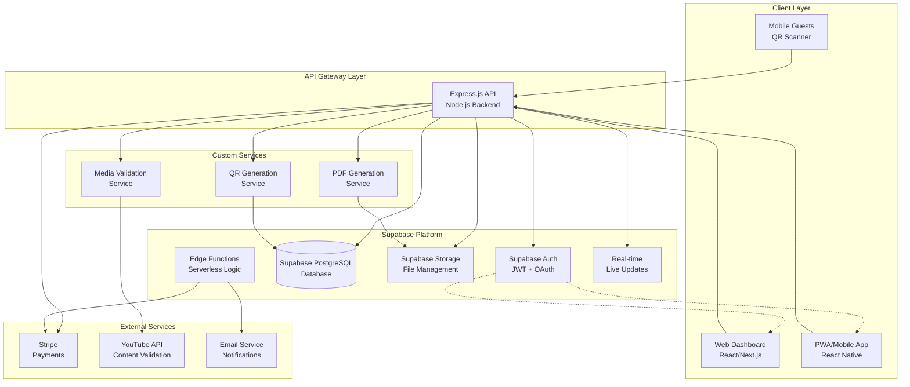
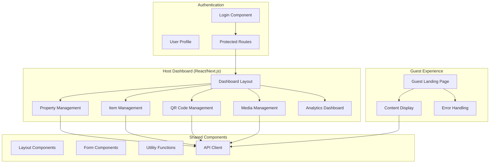
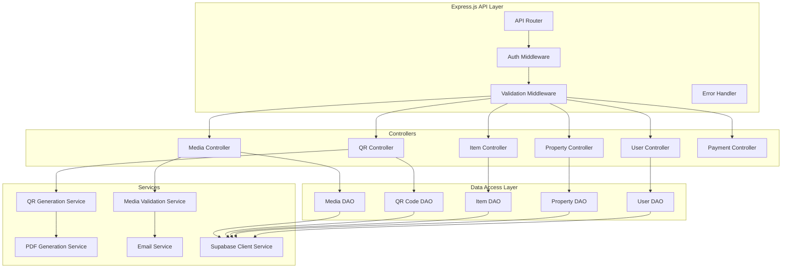
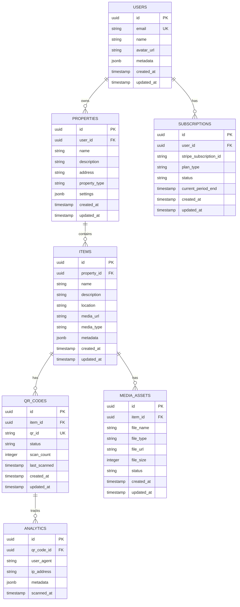
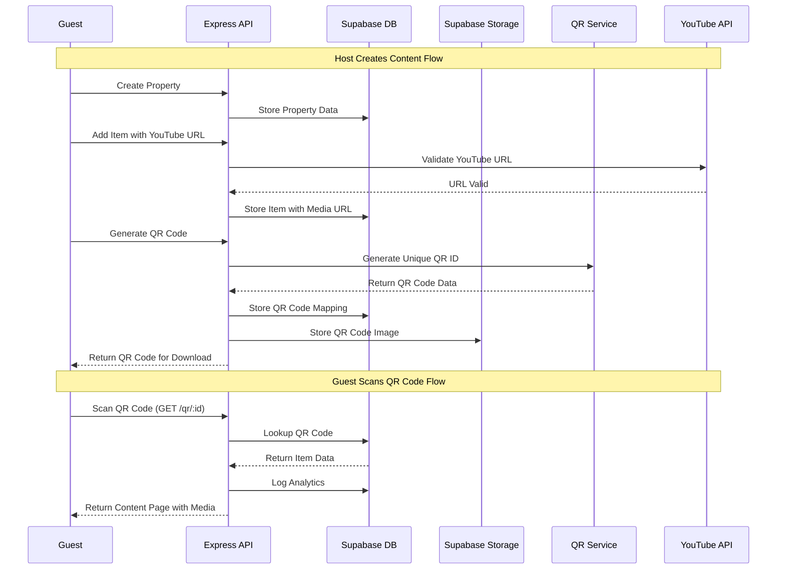
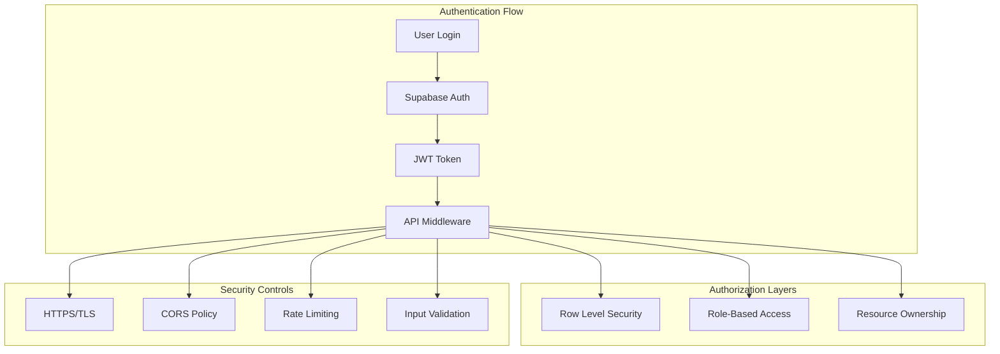
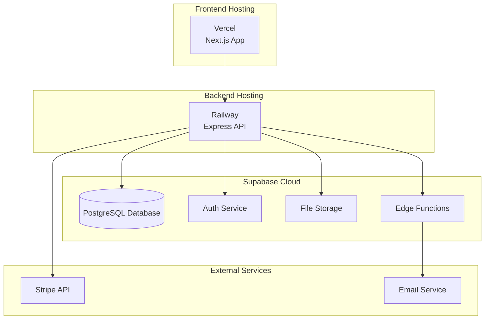

# Architecture Document: QR Code-Based Instructional System

**Project**: Request #001 - QR Code-Based Instructional System  
**Architecture**: Hybrid Supabase + Node.js/Express  
**Date**: January 2, 2025  
**Version**: 1.0

---

## 1. System Overview

The QR Code-Based Instructional System is a multi-tenant platform that enables property owners (hosts) to create digital instruction systems for rental properties using QR codes. Guests scan QR codes to access instructional content on mobile devices.

### Key Stakeholders
- **Hosts**: Create properties, manage items, upload content, generate QR codes
- **Guests**: Scan QR codes and access instructional content
- **Admins**: Monitor platform usage and manage system operations

---

## 2. High-Level Design (HDL) Diagram

---

## 3. Component Architecture

### 3.1 Frontend Components

### 3.2 Backend Services Architecture

---

## 4. Data Architecture

### 4.1 Database Schema

### 4.2 Data Flow Architecture

---

## 5. Technology Stack

### 5.1 Frontend Stack
- **Framework**: React 18+ with TypeScript
- **Meta-Framework**: Next.js 14+ (App Router)
- **Styling**: Tailwind CSS + Headless UI
- **State Management**: React Query + Zustand
- **Authentication**: Supabase Auth Client

### 5.2 Backend Stack
- **Runtime**: Node.js 18+
- **Framework**: Express.js with TypeScript
- **Database Client**: Supabase JavaScript Client
- **QR Generation**: `qrcode` + `uuid` libraries
- **PDF Generation**: `pdfkit`
- **Validation**: Zod schema validation

### 5.3 Infrastructure Stack
- **Database**: Supabase PostgreSQL
- **Authentication**: Supabase Auth
- **File Storage**: Supabase Storage
- **Payments**: Stripe API
- **Deployment**: Vercel (Frontend) + Railway (Backend)

---

## 6. Security Architecture

### 6.1 Authentication & Authorization

### 6.2 Security Measures
- **Authentication**: Supabase Auth with JWT tokens
- **Authorization**: Row Level Security (RLS) policies
- **Data Protection**: HTTPS/TLS encryption in transit
- **Input Validation**: Zod schema validation on all inputs
- **Rate Limiting**: API rate limiting per user/IP
- **CORS**: Strict CORS policies for API access
- **File Security**: Signed URLs for file access

---

## 7. Deployment Architecture

### 7.1 Production Deployment

### 7.2 Environment Configuration
- **Development**: Local Next.js + Local Express + Supabase
- **Staging**: Vercel Preview + Railway + Supabase (staging)
- **Production**: Vercel + Railway + Supabase (production)

---

## 8. Performance Considerations

### 8.1 Optimization Strategies
- **Frontend**: Code splitting, lazy loading, image optimization
- **Backend**: Connection pooling, query optimization, caching
- **Database**: Proper indexing, RLS optimization
- **CDN**: Static asset caching, edge caching
- **Real-time**: Selective subscriptions, connection management

### 8.2 Scalability Patterns
- **Horizontal Scaling**: Multiple backend instances behind load balancer
- **Database Scaling**: Supabase auto-scaling + read replicas
- **File Storage**: Supabase Storage with CDN distribution
- **Cache Strategy**: Redis for session and API response caching

---

## 9. Monitoring & Observability

### 9.1 Monitoring Stack
- **Application Monitoring**: Vercel Analytics + Sentry
- **Database Monitoring**: Supabase Dashboard + Alerts
- **API Monitoring**: Custom logging + error tracking
- **Performance Monitoring**: Core Web Vitals + API metrics

### 9.2 Key Metrics
- **Business Metrics**: QR scans, user registrations, conversions
- **Technical Metrics**: API response times, error rates, uptime
- **User Experience**: Page load times, mobile performance

---

## 10. Future Architecture Considerations

### 10.1 Scalability Roadmap
- **Microservices**: Split monolithic API into domain services
- **Event-Driven**: Implement event sourcing for analytics
- **Multi-Region**: Geographic distribution for global users
- **Mobile Apps**: Native iOS/Android applications

### 10.2 Technology Evolution
- **Backend**: Potential migration to Deno/Bun for performance
- **Frontend**: React 19+ features, Server Components optimization
- **Database**: Potential sharding strategies for large scale
- **AI Integration**: Content generation and optimization features

---

*Architecture Document Version 1.0 - January 2, 2025*  
*Next Review: March 2025* 